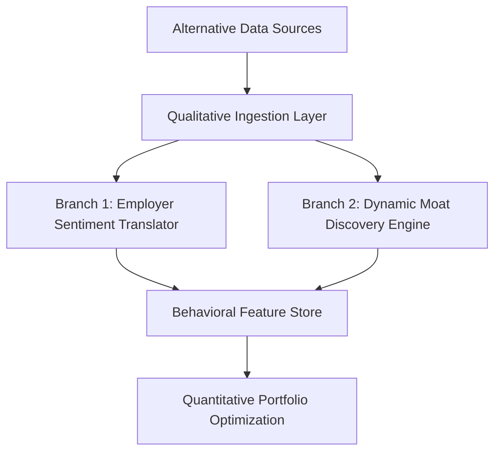

# Qualitative Blueprint: Master Strategy & Architectural Roadmap

This document serves as the master roadmap and technical reference for the Qualitative components of the `quant-py` workspace. It outlines the strategy, financial and mathematical scoring calculations, component mapping, and folder skeleton structures.

---

## 1. Executive Strategy & Framework

The Qualitative portion of `quant-py` manages the ingestion, cleaning, normalization, and scoring of alternative, unstructured, and qualitative data sources. It translates qualitative signals into clean, standardized inputs for downstream quantitative modeling and portfolio optimization.

### Decoupled Dual-Branch Architecture

The framework is divided into two execution branches to guarantee clean data separation and zero lookahead bias:



1. **Branch 1: Employer Sentiment Translator**
   - Normalizes ratings, culture metrics, and employee satisfaction trends across disparate public review channels (**Glassdoor**, **Indeed**, and **Comparably**).
   - Serves as a leading indicator of talent retention, execution velocity, and organization attrition risks.
2. **Branch 2: Dynamic Moat Discovery Engine**
   - Resolves corporate registry anchors (such as CIK identifiers and GitHub handles) to map developer momentum, product breadth, and patent/Wikipedia infobox signals.
   - Translates developer contributions, API activity, and platform metrics into namespace-guarded corporate moats.

---

## 2. Core Financial & Mathematical Calculations

All qualitative signals undergo strict mathematical standardizations and cash-flow adjustments before ingestion into the database:

### A. Cold-Start EMA Filter
To prevent statistical instability with new or sparse data, the pipeline uses an expanding-mean smoothing method when the number of observations $N < 5$. Once $N \ge 5$, it transitions to an exponential moving average (EMA) with a decay factor $\alpha$ determined by the configurable half-life:
$$\alpha = 1 - e^{-\frac{\ln(2)}{\text{halflife}}}$$

### B. Two-Stage Double Standardizer
1. **Stage 1 (Time-Series):** Computes expanding time-series z-scores:
   $$z = \frac{x - \mu}{\sigma}$$
   The resulting z-score is compressed via a hyperbolic tangent clamp:
   $$\text{clamped\_z} = \tanh\left(\frac{z}{2.0}\right)$$
2. **Stage 2 (Cross-Sectional):** Performs daily peer-group z-score normalization across assigned sub-sectors (`semiconductors`, `platform_software`, `hardware_oem`) to eliminate industry-specific bias.

### C. 3-Year R&D Amortization & Capitalization
Operating R&D expenses are capitalized into balance-sheet intangible assets. They are amortized using straight-line schedules matching sector-specific lives (5.0 years for semiconductors/hardware, 4.0 years for software) to reconstruct the true Net Operating Profit After Tax (NOPAT) and Free Cash Flow (FCF).

### D. Stock-Based Compensation (SBC) Drag Intensity
Calculates dilution risk and operational drag intensity:
$$\text{Drag} = \min\left(1.0, 10.0 \times \left(0.4 \times \frac{\text{SBC}}{\text{Shares} \times \text{Price}} + 0.6 \times \frac{\text{SBC}}{\text{Revenue}}\right)\right)$$

### E. Trajectory Corridor Engine
A piecewise multi-stage growth decay model that clamps signals within an asymmetric corridor between a floor ($0.15$) and a ceiling ($0.92$):
$$\text{Output} = f(\text{clamped\_z})$$

### F. Ecosystem Market-Share Displacement Ratio (DR) & Monte Carlo Parameters
To capture real-time competitive shifts before they result in permanent failures, the engine cross-examines companies within the same sub-sector (e.g., comparing NVDA vs. AMD inside the semiconductors group).

The rolling 2-year developer engagement slope $\Delta$ is calculated from stars, forks, and open issues in `github_org_metrics`:
$$\Delta = \sum_{\text{repos}} \frac{\text{stars} + \text{forks} + \text{open\_issues}}{\max(0.1, \text{age\_in\_years})}$$
The relative displacement ratio $DR$ is calculated as:
$$DR = \frac{\max(0, \; \Delta_{\text{Competitor}})}{\max(0, \; \Delta_{\text{Leader}}) + 1e-6}$$
When $DR > 1.0$:
- **Tweak A (Front-Loaded Competitor Moat Penalty)**: Replaces the flat, uniform CAP distribution with a Right-Skewed Beta Distribution ($\alpha = 2, \beta = 5$) on compressed bounds (maxing at 5 or 6 years).
- **Tweak B (Sales-to-Capital Capital-Efficiency Drag/Boost)**: Scales down the mean of the Sales-to-Capital ($S/C$) ratio for the dominant firm (leader) by up to 30%, while scaling up the capital efficiency parameter for the challenger by up to 30%.


## 3. Folder & File Skeleton Structure

The `Qualitative` directory is organized into two primary subpackages: `scraper` (the ingestion engine) and `psychological` (the modeling, feature translation, and scoring engine).

```
Qualitative/
├── Qualitative Blueprint.md             # This master roadmap document
├── scraper/                             # Ingestion & Scraping layer
│   ├── __init__.py                      # Package entry
│   ├── run_scraper.py                   # Master scraper CLI orchestrator
│   ├── reddit_client.py                 # API-free Reddit JSON client
│   ├── sec_scraper.py                   # SEC XBRL facts scraper
│   ├── hybrid_orchestrator.py           # Ingestion task coordinator
│   ├── data_fusion.py                   # Normalization logic
│   ├── health_monitor.py                # Scraper health tracking
│   ├── risk_detector.py                 # Throttling & block detection
│   ├── dynamic_extractor.py             # Field extraction rules
│   ├── engine.py                        # Low-level HTTP/browser connection
│   ├── binary_search_scraper.py         # Subreddit time range binary search
│   └── fintech_clients/                 # Third-party fintech scrapers
│       ├── __init__.py
│       ├── base.py                      # Base API client interface
│       ├── factory.py                   # Dynamic client instantiation
│       ├── normalizer.py                # Fintech field standardization
│       ├── rate_limiter.py              # Throttling policy engine
│       ├── apewisdom.py                 # ApeWisdom API client
│       └── stocktwits.py                # Stocktwits public JSON scraper
└── psychological/                       # Behavioral & Valuation translation layer
    ├── __init__.py                      # Package entry
    ├── qualitative_scoring.py           # EMA, Standardizers, R&D Capitalization
    ├── orchestrator.py                  # Master behavioral orchestrator
    ├── behavioral_feature_store.py      # Feature database interface
    ├── dcf_floor.py                     # DCF sentiment valuation floor
    ├── engineering_guards.py            # Lookahead and boundary checkers
    ├── velocity_tracker.py              # Posting tracking logic
    ├── signal_matrix.py                 # Assembles scoring matrices
    ├── state_machine.py                 # Tracking pipeline runs state
    └── scrapers/                        # Deep browser automation scrapers
        ├── __init__.py
        ├── corp_audit.py                # Glassdoor & Indeed scraper engines
        ├── corp_anonymous.py            # Comparably scraping interface
        ├── browserless_client.py        # Connects to headless chrome instances
        ├── cdp_stealth.py               # Chrome DevTools Protocol bypass
        ├── circuit_breaker.py           # Circuit breaker logic
        ├── proxy_manager.py             # Rotating proxy pool supervisor
        ├── redis_cache.py               # Temporary cache adapter
        ├── moat_discovery.py            # Wikipedia and GitHub organization scanner
        ├── github_tracker.py            # GitHub API repository metrics
        ├── hiring_velocity.py           # Hiring postings tracking
        ├── lightweight_scraper.py       # Fallback requests-based scraper
        ├── metrics_collector.py         # Ingestion success/failure stats
        ├── company_resolver.py          # Corporate registry & CIK resolver
        └── validation_gate.py           # AST & integrity checkers
```

---

## 4. File-by-File Responsibilities

### A. Scraper Package (`Qualitative/scraper/`)

*   **[run_scraper.py](file:///Users/hayden/Desktop/quant-py/Qualitative/scraper/run_scraper.py):** Main CLI entry point. Exposes tasks such as `scrape`, `aggregate`, `purge`, `init-db` to shell environments.
*   **[reddit_client.py](file:///Users/hayden/Desktop/quant-py/Qualitative/scraper/reddit_client.py):** Connects to public subreddits (e.g., `r/wallstreetbets`) and fetches public JSON endpoints. Enforces a strict 2.0-second delay sleep between requests.
*   **[sec_scraper.py](file:///Users/hayden/Desktop/quant-py/Qualitative/scraper/sec_scraper.py):** Scrapes SEC EDGAR XBRL data to retrieve annual/quarterly reports for target companies.
*   **[hybrid_orchestrator.py](file:///Users/hayden/Desktop/quant-py/Qualitative/scraper/hybrid_orchestrator.py):** Dynamically falls back from premium client endpoints to local web scraping logic in case of rate-limiting or failures.
*   **[data_fusion.py](file:///Users/hayden/Desktop/quant-py/Qualitative/scraper/data_fusion.py):** Fuses structured records (from SEC, Reddit, and Fintech API targets) into standardized records.
*   **[health_monitor.py](file:///Users/hayden/Desktop/quant-py/Qualitative/scraper/health_monitor.py):** Tracks live API error rates and flags degradation.
*   **[risk_detector.py](file:///Users/hayden/Desktop/quant-py/Qualitative/scraper/risk_detector.py):** Detects if the current IP or subnet has been flagged/blocked by web application firewalls.
*   **[dynamic_extractor.py](file:///Users/hayden/Desktop/quant-py/Qualitative/scraper/dynamic_extractor.py):** Parses fields from alternative data sources based on dynamic rules.
*   **[engine.py](file:///Users/hayden/Desktop/quant-py/Qualitative/scraper/engine.py):** Low-level HTTP requests handler with custom user-agents.
*   **[binary_search_scraper.py](file:///Users/hayden/Desktop/quant-py/Qualitative/scraper/binary_search_scraper.py):** Optimizes subreddit historic scraping by using binary search on epoch timestamps to fetch logs inside specific time bounds.
*   **`fintech_clients/`:** Contains API-specific normalization classes to ingest data from third-party fintech websites like ApeWisdom and Stocktwits.

### B. Psychological Package (`Qualitative/psychological/`)

*   **[qualitative_scoring.py](file:///Users/hayden/Desktop/quant-py/Qualitative/psychological/qualitative_scoring.py):** Mathematical signals engine implementing EMAs, stage standardizers, SBC drags, and capitalization logic.
*   **[orchestrator.py](file:///Users/hayden/Desktop/quant-py/Qualitative/psychological/orchestrator.py):** Coordinates execution sweeps across all five isolated lanes during night-shift processing.
*   **[behavioral_feature_store.py](file:///Users/hayden/Desktop/quant-py/Qualitative/psychological/behavioral_feature_store.py):** Fetches and saves normalized features to the target database.
*   **[dcf_floor.py](file:///Users/hayden/Desktop/quant-py/Qualitative/psychological/dcf_floor.py):** Evaluates adjusted intrinsic values by calculating discount corridors and cash-flow standard deviations.
*   **[engineering_guards.py](file:///Users/hayden/Desktop/quant-py/Qualitative/psychological/engineering_guards.py):** Enforces static limits on model parameters to ensure lookahead bias and cold-start boundary integrity.
*   **[velocity_tracker.py](file:///Users/hayden/Desktop/quant-py/Qualitative/psychological/velocity_tracker.py):** Tracks organizational changes and job growth ratios.
*   **`scrapers/`:**
    *   **[corp_audit.py](file:///Users/hayden/Desktop/quant-py/Qualitative/psychological/scrapers/corp_audit.py):** Large-scale scraper employing headless browsers to retrieve ratings and reviews from Glassdoor and Indeed.
    *   **[corp_anonymous.py](file:///Users/hayden/Desktop/quant-py/Qualitative/psychological/scrapers/corp_anonymous.py):** Complements reviews data by scraping Comparably profiles.
    *   **[cdp_stealth.py](file:///Users/hayden/Desktop/quant-py/Qualitative/psychological/scrapers/cdp_stealth.py):** Employs Chrome DevTools Protocol modifications to mask execution flags (WebGL vendor details, screen resolution indicators, user-agent overrides) to bypass Cloudflare protection.
    *   **[moat_discovery.py](file:///Users/hayden/Desktop/quant-py/Qualitative/psychological/scrapers/moat_discovery.py):** Evaluates patent counts and infrastructure components from Wikipedia infoboxes.
    *   **[github_tracker.py](file:///Users/hayden/Desktop/quant-py/Qualitative/psychological/scrapers/github_tracker.py):** Pulls commit frequency, repository additions, and open issue counts for mapped corporate GitHub domains.
    *   **[validation_gate.py](file:///Users/hayden/Desktop/quant-py/Qualitative/psychological/scrapers/validation_gate.py):** Enforces AST verification on scraped text content to ensure data formatting integrity before DB insertion.
