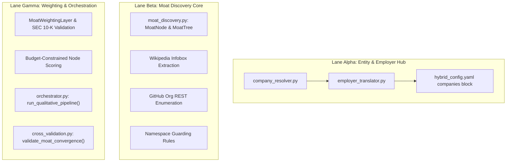

# Unified Straw Implementation Plan: Central Translator & Dynamic Moat Discovery Engine

## Executive Summary
This document outlines the master technical implementation plan for unifying all qualitative and alternative data sources (`Glassdoor`, `Indeed`, `Comparably`, `G2`, `Capterra`, `App Store`, `GitHub`, `Reddit`) into a dual-branch architecture:
1. **Branch 1: Employer Sentiment Translator** (Glassdoor ↔ Indeed ↔ Comparably normalization & agreement).
2. **Branch 2: Dynamic Moat Discovery Engine** (Wikipedia Infobox + GitHub Org enumeration → top-level platform node discovery → namespace-guarded scoring).

---

## 🛠️ Division of Labor Across Parallel Lanes

To prevent file collisions and maximize throughput across isolated worktrees (`lane_alpha`, `lane_beta`, `lane_gamma`), the tasks are divided cleanly by component boundaries:



---

### 🔵 **Lane Alpha (`scraper-glassdoor-indeed` branch)**
* **Primary Responsibility**: Entity Resolution & Branch 1 Employer Sentiment Translator.
* **Files Created/Modified**:
  * `[NEW] psychological/scrapers/company_resolver.py`
  * `[NEW] psychological/scrapers/employer_translator.py`
  * `[MODIFY] config/hybrid_config.yaml` (Add consolidated `companies:` block)
  * `[NEW] tests/test_company_resolver.py`
  * `[NEW] tests/test_employer_translator.py`
* **Implementation Details**:
  * Build `CompanyResolver` to act as the single source of truth for all ticker metadata (legal names, common names, platform slugs, GitHub org handles, SEC CIKs).
  * Build `EmployerTranslator` to run `GlassdoorScraper`, `IndeedScraper` (via `CorpAnonymousScraper`), and `ComparablyScraper` concurrently using their hybrid SERP→CDP cascades.
  * Implement 0.0–1.0 score normalization and compute source agreement metric.

---

### 🟢 **Lane Beta (`scraper-g2-bypass` branch)**
* **Primary Responsibility**: Branch 2 Moat Discovery Engine (Core Discovery & Namespace Guarding).
* **Files Created/Modified**:
  * `[NEW] psychological/scrapers/moat_discovery.py` (Core structures & Discovery engine)
  * `[NEW] tests/test_moat_discovery.py` (Discovery & Namespace guard tests)
* **Implementation Details**:
  * Define `MoatNode` and `MoatTree` dataclasses.
  * Implement **Wikipedia Infobox targeting** (`<table class="infobox">` extraction of products row) as the primary node discovery pathway.
  * Implement **GitHub Org REST enumeration** (`/orgs/{org}/repos?per_page=100`) with local star filtering (>100 stars).
  * Implement **Strict Namespace Guarding**: single-word node names auto-prepend company common name (e.g., `"Apex"` → `"NVIDIA Apex"`).
  * Deduplicate and cap discovered nodes to **top-level structural platforms (≤8 per ticker)**.

---

### 🟡 **Lane Gamma (`scraper-alt-sources-cab` branch)**
* **Primary Responsibility**: Moat Weighting, Scoring Loops, & System Orchestration.
* **Files Created/Modified**:
  * `[MODIFY] psychological/scrapers/moat_discovery.py` (Add `MoatWeightingLayer` & scoring loops)
  * `[MODIFY] psychological/orchestrator.py` (Add `run_qualitative_pipeline()`)
  * `[MODIFY] psychological/scrapers/cross_validation.py` (Add `validate_moat_convergence()`)
  * `[NEW] tests/test_central_translator_integration.py`
* **Implementation Details**:
  * Implement `MoatWeightingLayer`: weight nodes by GitHub star velocity decay + SEC 10-K revenue segment cross-referencing + manual `moat_overrides`.
  * Implement budget-constrained scoring loop (**≤20 SERP queries per ticker**) across G2, Reddit, Capterra, and App Store RSS.
  * Integrate both branches into `PsychologicalOrchestrator.run_qualitative_pipeline(ticker)`.
  * Update `CrossValidationEngine` to validate convergence between GitHub dev momentum and product sentiment.

---

## 📐 Master Architecture & Engineering Mitigations

### 1. Combinatorial Query Explosion Mitigated
* Nodes capped at ≤8 top-level platforms per ticker.
* Shared request budget of ≤20 SERP queries per ticker run.
* Bottom nodes use free GitHub/RSS signals if budget expires.

### 2. 10-K Parsing Minefield Avoided
* Wikipedia Infobox key-value extraction is primary.
* SEC 10-K demoted to revenue segment cross-referencing (weighting only).

### 3. Semantic Collision Eliminated
* Single-word terms auto-wrapped with company common name (`"NVIDIA Apex"`).

### 4. GitHub API Limits Resilient
* Replaced Search API with Core Org REST (`/orgs/{org}/repos?per_page=100`). Cost = 1 request out of 5,000/hr allowance.

---

## 🧪 Verification & Final Summary Command
Each lane will run its isolated test suite, and the central hub run will validate full integration via:
```bash
python3 -m pytest tests/test_central_translator_integration.py -v
```
